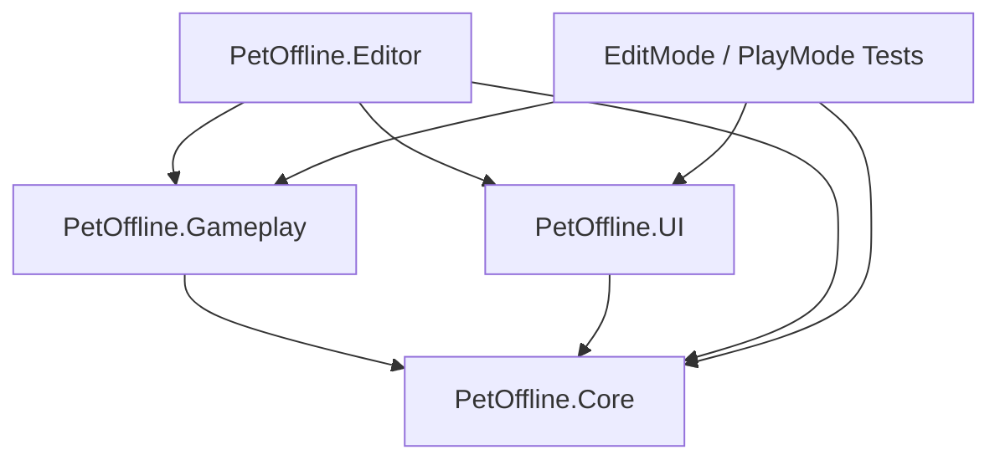

# Pet Offline Architecture Audit

更新日期：2026-07-15

## 审计结论

当前静态分层符合 World owns gameplay; UGUI presents state 契约。最终 Validator 于 UTC 2026-07-15T15:20:06Z 返回 PASS，且晚于当前代码最后修改。

最终 EditMode 3/3、PlayMode 33/33、Day 1/Day 2 UIRoot-disabled、Windows Player 双结局、跨进程 Continue 和双 Build 证据均已落盘。Validator 本身仍只证明 Scene、引用、asmdef 与 World/UI 规则；完整流程结论同时依赖 TEST_REPORT.md 中列出的 Player 与测试证据。

## 依赖方向

| Assembly | 当前直接项目依赖 | 审计结果 |
| --- | --- | --- |
| PetOffline.Core | 无其他 PetOffline assembly | 符合 |
| PetOffline.Gameplay | PetOffline.Core | 符合 |
| PetOffline.UI | PetOffline.Core | 符合 |
| PetOffline.Editor | Core、Gameplay、UI；仅 Editor 平台 | 符合 |
| Tests | 按测试需要引用生产 assembly | 测试专用 |

PetOffline.UI.asmdef 不引用 Gameplay；PetOffline.Gameplay.asmdef 不引用 UI。ProjectValidator 会读取两个 asmdef 并拒绝反向依赖。

## 状态与命令边界

| 范围 | 权威所有者 | 对外方式 |
| --- | --- | --- |
| 应用流程、存档、当前关卡 | GameSession、SceneFlowService、SaveService | Core 服务与 ICommandSink |
| Day 1 主状态、局部重置、Boss Call | LevelOneFlowController | LevelSceneContext / ILevelViewModel |
| Day 2 SunTime、确认、Camera、路线、结局 | LevelTwoFlowController | LevelSceneContext / ILevelViewModel |
| 玩家、物品、相机、机器人、Trigger | Gameplay World Components | 世界事件供 Flow 消费 |
| HUD、报告、选择、暂停、标题 | UIRootController | 读取 ILevelViewModel，提交 ICommandSink |

UIRootController 只持有 Core 的 ILevelViewModel 与 ICommandSink/GameSession。报告继续和最终选择通过 ContinueReport、SubmitChoice 发送高层命令；实际状态推进和世界演出由关卡 Flow 执行。

## Scene 与生命周期

| Scene | 责任 | Build Settings |
| --- | --- | --- |
| 00_Bootstrap | 常驻服务、Main Camera、UIRoot、EventSystem | 启用，Index 0 |
| 10_Day1_Meeting | Day 1 World | 启用 |
| 20_Day2_Sunbath | Day 2 World | 启用 |
| 90_UIRoot_Test | UI Mock/等待状态预览 | 存在但禁用 |

两个 World Scene 均使用 WorldRoot，并包含 Environment、Collision、Actors、Interactables、Devices、Sensors、Triggers、Paths、WorldVFX、WorldAudio、LevelFlow 与 VirtualCamera 等世界节点。屏幕 HUD 位于 Bootstrap/UIRoot，不由 World Scene 持有。

SceneFlowService additive 加载 World，并在切换前卸载旧 World。GameSession 在 Scene 加载后绑定该 Scene 的 ILevelRuntime 与 ILevelViewModel。

## Validator 覆盖

Tools/Pet Offline/Validate Project 当前检查：

- PlayerController2D、CarryController、CameraVisionSensor2D、RobotPatrol、LevelFlowController 等 Gameplay 类型不得位于 Canvas 下。
- Gameplay MonoBehaviour 不得使用 RectTransform。
- WorldRoot 下不存在脱离 Canvas 的 RectTransform。
- UI 与 Gameplay asmdef 不互引。
- 必需 Scene 位于 Build Settings。
- 必需 Physics/Sorting Layer 存在。
- Scene 无 Missing Script。
- RequiredReference 字段和关键场景引用不缺失。
- Bootstrap 服务唯一且完整。
- Day 1/Day 2 配置、Flow、相机、物品和关键对象满足最低数量及引用规则。
- 七个必需 AudioCueDefinitionSO 资产存在且引用 AudioClip。

最新证据：

- Artifacts/TestResults/ValidationReport.txt：PASS
- Unity：6000.3.14f1
- UTC：2026-07-15T15:20:06.8003445Z

该报告属于当前工作树最终回归。里程碑历史证据仍引用带里程碑后缀的独立日志/XML，不能把当前 ValidationReport.txt 当作旧提交的固定证据。

## 测试证据边界

| 要求 | 当前证据 |
| --- | --- |
| Day 1 UIRoot-disabled | `PlayMode_Final.xml` PASS |
| Day 2 UIRoot-disabled | `PlayMode_Final.xml` PASS |
| UIRoot Mock | `EditMode_Final.xml` / `PlayMode_Final.xml` PASS |
| Architecture boundary | Validator PASS；EditMode 3/3 PASS |
| 两个结局 | Windows Player 2/2 PASS |
| Title-to-ending | `StandalonePlayMode_Screenshots_Final.xml` PASS |
| 跨进程 Continue | Seed 1/1、下一进程 Continue 1/1 PASS |

Validator PASS 不证明玩家流程、物理时序、软锁恢复、存档跨进程或 Standalone 行为。

## 未关闭项

- 正式美术与字体/标题资源授权链确认。
- 首次玩家 12–15 分钟计时和教学理解度。
- 目标机 Profiler/FrameTiming、失焦/多显示器与干净机断网验证。
- Release 正常时长人工完整分支。

这些是外部体验和发布验收缺口，不改变当前 World/UGUI 架构与功能垂直切片已经通过自动化门槛的结论。
