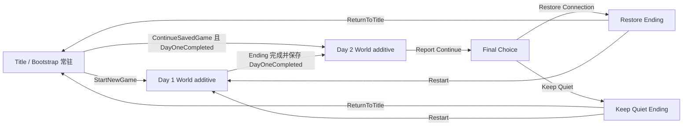
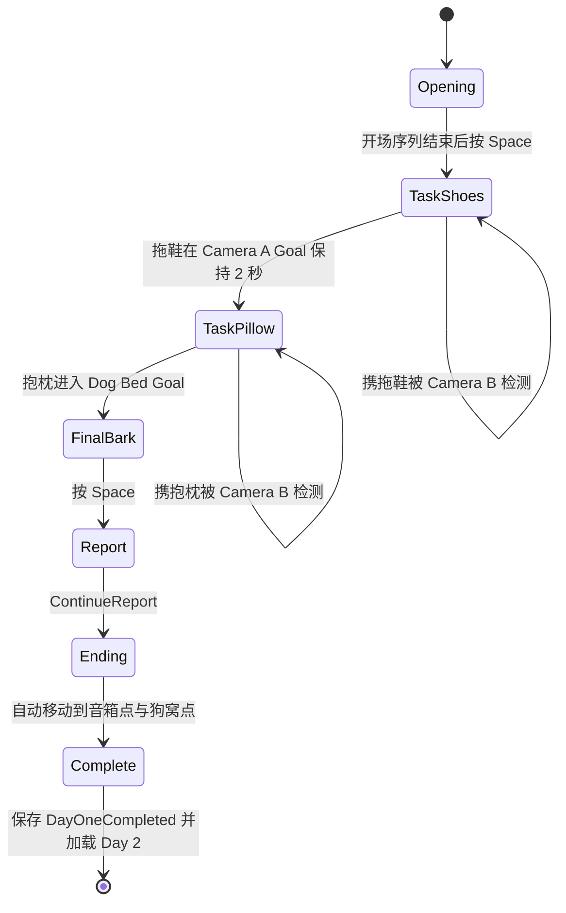
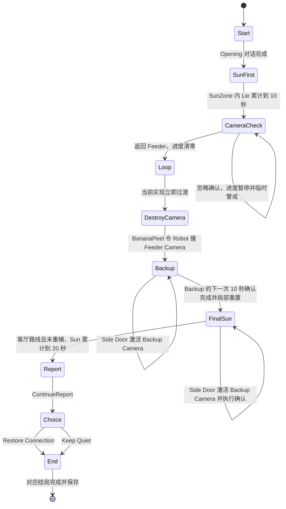

# Pet Offline State Machines

更新日期：2026-07-15

本文记录当前显式状态机与转移责任，来源为 GameSession、SceneFlowService、LevelOneFlowController、LevelTwoFlowController 和 SOURCE_OF_TRUTH.md。当前实现已通过最终 PlayMode 33/33、Windows Player 双结局与跨进程 Continue 验收；人工正常时长体验仍见 KNOWN_GAPS.md。

## 应用与 Scene 流程

Bootstrap 持有 GameSession、SceneFlowService、InputRouter、AudioService、SaveService、DialogueDirector、Main Camera 与 UIRoot。World Scene additive 加载；SceneFlowService 负责确保同一时刻只保留一个 World Scene。

UI 通过 Core 的 ICommandSink 提交 StartNewGame、ContinueSavedGame、ContinueReport、SubmitChoice、ReturnToTitle 和 Restart。UI 不直接移动角色、开关摄像头或写入关卡状态。

## Day 1：狗已上线

| 状态 | 进入条件 | 权威行为 | 退出条件 |
| --- | --- | --- | --- |
| Opening | Day 1 Bind | 播放固定开场；移动锁定；等待开场完成后的 Gameplay Bark | 按 Space |
| TaskShoes | Opening Bark | 解锁移动；拖鞋可用；Camera B 只在携带当前拖鞋时触发失败 | Camera A Goal 保持 2 秒 |
| TaskPillow | 拖鞋完成 | 锁定拖鞋；解锁重抱枕；重物减速；携带时 Bark 掉落 | 抱枕进入狗窝 Goal |
| FinalBark | 抱枕完成 | 取消 Boss Call 与 Camera 临时窗口；等待无失败 Bark | 按 Space |
| Report | Final Bark | 禁用 Gameplay 输入；发布 Day 1 ReportDefinitionSO | ContinueReport |
| Ending | ContinueReport | 世界自动演出，不由 UI 移动 Latte | 演出完成 |
| Complete | Ending 完成 | 保存 DayOneCompleted；请求加载 Day 2 | Scene 切换 |

### Day 1 局部重置

- 鞋任务失败只重置 Latte、拖鞋、Camera A Goal 进度、Camera B 扫描角及临时安全/警戒状态。
- 抱枕任务失败只重置 Latte、抱枕、Dog Bed Goal 进度、Camera B 扫描角及临时安全/警戒状态。
- 抱枕失败不撤销 ShoesCompleted。
- Opening 不重播。
- Camera B 不因空手穿越或携带非当前任务物而重置任务。

### Boss Call 并行子状态

Boss Call 只在 TaskShoes 与 TaskPillow 计时：

- 响应窗内 Bark：进入短暂安全窗口，Camera B 检测被抑制。
- 超时：进入临时警戒，Camera B 加速并扩大检测。
- 超时不会 Game Over，也不会改变主状态。
- 每次响应完成后重新装载下一次确定性倒计时。

## Day 2：偷偷安抚

| 状态 | 关键规则 |
| --- | --- |
| Start | 初始化 Feeder Camera 在线、Backup Camera 关闭、太阳进度为 0，播放开场。 |
| SunFirst | 唯一可见主目标固定为“让拿铁晒满20秒太阳”；进入 SunZone 且 Lie 才累计。 |
| CameraCheck | 第一次达到 10 秒后暂停太阳进度；返回 Feeder 完成确认并清零；忽略只临时增强扫描。 |
| Loop | 当前实现中的瞬时过渡标记；Feeder 确认后立即进入 DestroyCamera，不是持久玩家状态。 |
| DestroyCamera | 可搬 BananaPeel 放到 Robot 路径；Robot 滑向 Feeder；只关闭 Camera，Feeder 本体保持工作。 |
| Backup | Feeder Camera 离线；Side Door 激活 Backup Camera；错误路线必须经历下一次 10 秒确认。 |
| FinalSun | BackupLessonCompleted、两摄像头均不活动、无确认、当前尝试未被重捕时，才能从客厅路线累计到 20 秒。 |
| Report | 禁用 Gameplay 输入并发布固定 Day 2 报告。 |
| Choice | 只接受 RestoreConnection 或 KeepQuiet 高层命令。 |
| End | 执行所选世界结局并保存 DayTwoCompleted 与 LastChoice。 |

### Day 2 确认与错误路线

- ConfirmationActive 时太阳进度保持暂停。
- Feeder Camera 在线时回到 Feeder Area：确认完成、SunTime 归零，然后进入破坏摄像头阶段。
- 忽略确认：相机临时警戒，不 Game Over。
- Robot 撞击后 FoodCameraActive=false；Feeder 本体和离线显示仍存在。
- Feeder 离线后经过 Side Door：BackupCameraActive=true，太阳进度归零。
- Backup Camera 的 10 秒确认完成后：关闭 Backup、记录 BackupLessonCompleted、把 Latte 重置到 retry 点、SunTime 归零并进入 FinalSun。
- FinalSun 再次进入 Side Door 会重新激活 Backup 流程。

### 两个结局

Restore Connection：

1. 恢复 Feeder Camera。
2. 清零 SunTime 并重新开放 Gameplay。
3. 再次累计到 10 秒。
4. 触发新的确认和主人点名后，才保存 RestoreConnection 结局。

Keep Quiet：

1. 关闭 Feeder 与 Backup Camera。
2. 禁止进一步远程确认。
3. Latte 自动移动到睡眠点并躺下。
4. 显示固定字幕：

   它不是不想你。
   它只是终于不用证明它在想你。

5. 保存 KeepQuiet 结局。

## 验证状态

- 最终 Tools/Pet Offline/Validate Project：PASS，见 `Artifacts/TestResults/ValidationReport.txt`，UTC 2026-07-15T15:20:06Z。
- 最终 EditMode：3/3 PASS；最终 PlayMode：33/33 PASS。
- Windows Player 双结局/截图：2/2 PASS。
- 跨进程 Seed 与下一进程 Continue：各 1/1 PASS。
- Day 1 历史里程碑证据仍保留在 `Artifacts/TestResults/PlayMode_M1.xml`，最终结论以 `PlayMode_Final.xml` 为准。
